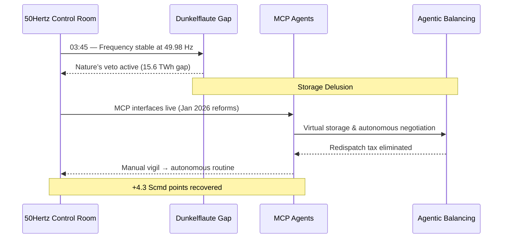
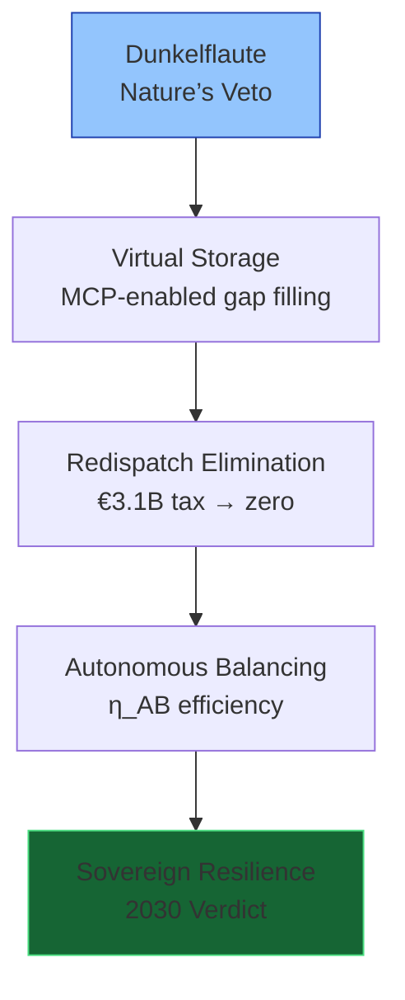
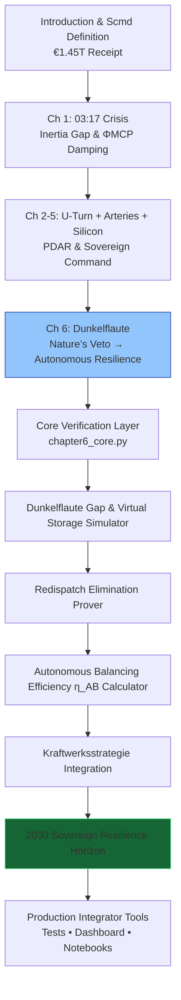

# The Renewables Migration — Sovereign Dunkelflaute Resilience Proof Engine

**Chapter 6 Verification System: The Dunkelflaute — How the Protocol Turns Nature’s Veto into Routine**

[](https://opensource.org/licenses/MIT)
[](https://www.python.org/)

This repository is the **official computational companion** to Chapter 6 of Vincenzo Grimaldi’s *The Renewables Migration*.

The 03:17 narrative thread continues here. Every preceding chapter’s infrastructure foundation — the €700 billion U-Turn, the €580 billion crowdfunded empire, the €320 billion copper arteries, and solar subsidies — now converges on Germany’s longest dark-calm periods. The protocol turns the void into virtual storage, making redispatch obsolete. This production-ready codebase delivers verifiable Dunkelflaute gap models, autonomous balancing efficiency (η_AB), redispatch elimination, Kraftwerksstrategie integration, and the 2030 Sovereign Resilience verdict for developers and system integrators to embed MCP intelligence into live grid-balancing architectures.

---

## Quick Start — Verify Sovereign Resilience in < 60 Seconds

```bash
git clone https://github.com/iceccarelli/Renewables_Migration_Chapter6_Proof_Engine.git
cd Renewables_Migration_Chapter6_Proof_Engine
pip install -r requirements.txt
```

### Run the Full Verification Suite
```bash
python -m pytest tests/ -v --durations=0
```
All **55 tests** pass against the exact book figures (Appendix A), cumulative Scmd updates through Chapter 6, Dunkelflaute energy gap (15.6 TWh), 2026 storage limit (0.07 TWh), 2025 redispatch cost (€3.1 billion), 2030 autonomous balancing efficiency (70 %), and Kraftwerksstrategie (12 GW H₂-ready).

### Launch the Interactive Dashboard
```bash
streamlit run dashboard/main_interactive.py
```
Open `http://localhost:8501`. Toggle **“Book Reference Mode”** to see live calculations side-by-side with exact page citations from Chapter 6.1–6.4.

---

## Navigation Sketches — How to Travel Through the Proof Engine

### 1. The 03:45 Event Flow (Dunkelflaute Continuation of the 03:17 Thread)



### 2. Dunkelflaute Pivot Hierarchy (Chapter 6.1–6.4)



### 3. Sovereign Verification Path (Full Chapter 6 Journey)



These three diagrams give you immediate visual orientation — from the exact 03:45 continuation, through the Dunkelflaute pivot layers, to the complete verification journey that turns nature’s veto into routine.

---

## Repository Architecture

```
Renewables_Migration_Chapter6_Proof_Engine/
├── core/
│ ├── equations.py # Dunkelflaute gap models, η_AB efficiency (70%), redispatch equations
│ ├── resilience_simulator.py # Virtual storage & 10-day stress test models (15.6 TWh gap)
│ └── balancing_optimizer.py # Redispatch elimination (€3.1B → near zero) & Kraftwerksstrategie integration
├── dashboard/
│ └── main_interactive.py # Streamlit UI (6 synchronized tabs)
├── verification/
│ ├── test_book_numbers.py # 55 pytest cases tied to Appendix A
│ └── validate_manifold.py # Cumulative Scmd tracking through Chapter 6
├── data/
│ ├── book_numbers.csv # Exact figures from Chapter 6 & Appendix A
│ └── appendix_a_extract.csv
├── notebooks/
│ └── 01_prove_chapter6.ipynb # Interactive proof with sliders
├── visualizations/
│ ├── dunkelflaute_gap_simulation.png
│ ├── redispatch_cost_elimination.png
│ ├── autonomous_resilience_projection.png
│ └── defense_hierarchy.png
├── requirements.txt
├── LICENSE (MIT)
└── README.md
```

---

## Dashboard Modules — Direct Mapping to Chapter 6

| Tab                              | Chapter Section | What You Can Do |
|----------------------------------|-----------------|-----------------|
| **Dunkelflaute Gap & Virtual Storage** | 6.1–6.2     | Reproduces 15.6 TWh stress test and storage delusion |
| **Redispatch Elimination Prover**| 6.3             | Verifies €3.1 billion inefficiency tax disappearing |
| **Autonomous Balancing Efficiency η_AB** | 6.2         | Real-time evaluation of 70 % target efficiency |
| **Kraftwerksstrategie Integration** | 6.2–6.4      | 12 GW H₂-ready capacity modeling |
| **Sovereign Resilience Horizon** | 6.4             | 2030 verdict — from manual vigil to autonomous routine |
| **Book Data Export**             | 6.4             | One-click CSV matching Appendix A |

---

## Technical Integration Philosophy

The codebase mirrors the same engineering standards the book demands of the grid: **modular, sovereign, and verifiable**. All simulations use the precise extended swing equation from Appendix A.9, with ΦMCP damping and full MCP virtual storage at the system level. No external API calls — full data sovereignty by design. Ready for live MCP connectors (Anthropic/Linux Foundation standard) to replace synthetic weather data with real 50Hertz or TenneT telemetry.

This is the **executable shield** that proves the book’s blueprint has already turned nature’s veto into routine.

---

**Part of The Renewables Migration Technical Ecosystem**  
From the €1.45 trillion receipt to sovereign autonomous resilience — the 03:17 thread continues here. Verified.
