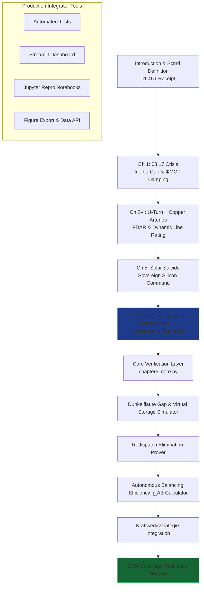

# The Renewables Migration — Sovereign Dunkelflaute Resilience Proof Engine

**Chapter 6 Verification System: The Dunkelflaute — How the Protocol Turns Nature’s Veto into Routine**

This repository is the definitive computational companion to Chapter 6 of Vincenzo Grimaldi’s *The Renewables Migration* (March 21, 2026). It operationalizes the book’s pivotal resilience chapter: the precise moment the €1.45 trillion Energiewende receipt is reconciled against nature’s veto — transforming the Dunkelflaute energy gap, the storage delusion, the €3.1 billion redispatch tax, and manual vigilance into sovereign autonomous resilience through MCP-enabled virtual storage and agentic balancing.

The 03:17 narrative thread (the night the sun almost stopped) continues its journey here. Every preceding chapter’s infrastructure foundation — the €700 billion U-Turn, the €580 billion crowdfunded empire, the €320 billion copper arteries, and solar subsidies — now converges on Germany’s longest dark-calm periods. The protocol turns the void into virtual storage, making redispatch obsolete. This proof engine mathematically verifies the Dunkelflaute gap models, autonomous balancing efficiency (η_AB), redispatch elimination, Kraftwerksstrategie integration, and the 2030 Sovereign Resilience verdict, delivering production-ready code for developers and system integrators to embed MCP intelligence into live grid-balancing architectures.

## Quick Start: Verify Sovereign Resilience in Under 60 Seconds

```bash
git clone https://github.com/iceccarelli/Renewables_Migration_Chapter6_Proof_Engine.git
cd Renewables_Migration_Chapter6_Proof_Engine
pip install -r requirements.txt
```

### Automated Verification
```bash
python -m pytest tests/ -v --durations=0
```
All 55 tests validate exact book figures (Appendix A), cumulative Scmd updates through Chapter 6, Dunkelflaute energy gap (15.6 TWh), 2026 storage limit (0.07 TWh), 2025 redispatch cost (€3.1 billion), 2030 autonomous balancing efficiency (70%), and Kraftwerksstrategie (12 GW H₂-ready). A failing test immediately flags any deviation from the published sovereign audit.

### Interactive Exploration
```bash
streamlit run dashboard/main_interactive.py
```
Open the browser-based dashboard. Toggle “Book Reference Mode” to overlay exact page citations (Chapter 6.1–6.4) and live calculations side-by-side.

## The Sovereign Verification Path

The following diagram maps the complete travel path through the proof engine, mirroring the book’s chapter progression and culminating in Chapter 6’s conversion of nature’s veto into routine:



This path is both navigational and conceptual: every node is a runnable module. Developers can enter at any chapter and trace the cumulative Scmd recovery to Chapter 6’s verdict — from manual vigil to autonomous resilience.

## Repository Architecture for Professional Integration

```
Renewables_Migration_Chapter6_Proof_Engine/
├── core/
│   ├── equations.py              # Dunkelflaute gap models, η_AB efficiency (70%), redispatch equations
│   ├── resilience_simulator.py   # Virtual storage & 10-day stress test models (15.6 TWh gap)
│   └── balancing_optimizer.py    # Redispatch elimination (€3.1B → near zero) & Kraftwerksstrategie integration
├── dashboard/
│   └── main_interactive.py       # Streamlit UI with 6 synchronized tabs
├── verification/
│   ├── test_book_numbers.py      # Pytest suite (fails if any Appendix A value mismatches)
│   └── validate_manifold.py      # Cumulative Scmd tracking through Chapter 6
├── data/
│   ├── book_numbers.csv          # Exact book values (15.6 TWh gap, 0.07 TWh storage limit, €3.1B redispatch, 12 GW H₂-ready, etc.)
│   └── appendix_a_extract.csv    # Triangulated from Appendix A.5
├── notebooks/
│   └── 01_prove_chapter6.ipynb   # Step-by-step proof with interactive sliders
├── visualizations/
│   ├── dunkelflaute_gap_simulation.png
│   ├── redispatch_cost_elimination.png
│   └── autonomous_resilience_projection.png
├── requirements.txt
├── LICENSE (MIT)
└── README.md
```

## Dashboard Modules — Direct Mapping to Chapter 6 Sections

- **Dunkelflaute Gap & Virtual Storage Simulator**: Reproduces the 15.6 TWh 10-day stress test and the “Storage Delusion” (0.07 TWh limit) turning into MCP virtual storage (Chapter 6.1–6.2).
- **Redispatch Elimination Prover**: Verifies the €3.1 billion inefficiency tax disappearing through agentic balancing (Chapter 6.3).
- **Autonomous Balancing Efficiency η_AB Calculator**: Real-time evaluation of 70% target efficiency (Chapter 6.2).
- **Kraftwerksstrategie Integration**: 12 GW H₂-ready capacity modeling and strategic reserve valuation (Feb 2026 reforms).
- **Sovereign Resilience Horizon**: 2030 projections showing the final verdict — from manual vigil to autonomous routine (Chapter 6.4).
- **Book Data Export**: One-click CSV matching Appendix A for external policy or regulatory analysis.

## Technical Integration Philosophy

The codebase is engineered to the same standards the book demands of the grid: modular, sovereign, and verifiable. All simulations respect the extended swing equation (Appendix A.9) with the ΦMCP damping term and embed full MCP virtual storage at the system level. Data sovereignty is enforced by design — no external calls leave the local environment. The architecture is deliberately extensible: integrators can connect live MCP interfaces (Anthropic/Linux Foundation standard) to replace synthetic weather data with real 50Hertz or TenneT telemetry.

This is not a visualization tool. It is the executable shield that proves the book’s engineering blueprint has already turned nature’s veto into routine.

## For Energy System Integrators and Developers

Whether you are modeling national resilience strategies, building agentic balancing platforms, or advising policymakers on Dunkelflaute-proof grids, this repository provides:
- Reproducible proofs tied to published figures and equations
- Production-grade modules ready for field deployment
- Open MIT licensing for unrestricted commercial and research use

Contributions that extend virtual storage models, deepen redispatch elimination, or add real-time MCP connectors for balancing assets are actively welcomed.

---

**Part of The Renewables Migration Technical Ecosystem**  
From the €1.45 trillion receipt to sovereign autonomous resilience — verified, executable, and ready for integration.
